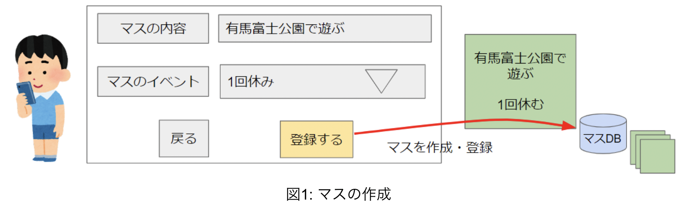
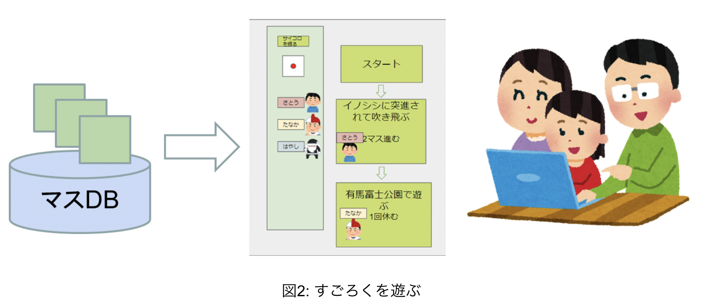

# 要求仕様書  こうみん未来塾すごろくアプリ

## メンバー

- 中橋 友郎
- 堀江 寛
- 坂井 廉
- 福嶋 いづみ
- 松本 凌太

## システムの目的

三田市では，「こうみん未来塾」という子どもに対する社会教育事業が行われている。「こうみん未来塾」において，子どもたちが三田市について調べたことをもとに，すごろくを作成し遊ぶ企画が考えられている。この企画においては三田市について調べて，遊ぶことでふるさと意識を醸成することや，調べたことを子どもが教えて発信することを目的としている。
　本システムにおいては，子どもが三田市について調べた内容をもとにしたマスを作成し，すごろくを作ることで，「すごろく作成企画」を支援することを目的とする。

## システムの概要

本システムは，すごろくの生成・遊ぶことができるWebアプリケーションとして実装される。

　参加者である子どもはマス作成者としてのアカウントを取得する。
マス作成者は，自身が調べた三田市に関するマスの説明とアクション(○マス進む／戻る，○回休みなど)などを入力し，マスを作成する(下図1)。

作成したマスは作成者と紐づき、すごろくで遊ぶ時にペンネームを表示する。
マス作成の権限は各イベントによって有効期限を設ける。
有効期限を過ぎた場合、マス作成を行うことができなくなる。

一般ユーザーは，「すごろくを遊ぶ」「マス一覧を見る」ことが可能なアカウントである。遊びたいプレイヤー数やコースの長さ（短い・中間・長いから選択）、対象とするマスの作成時期を指定する。
システムは情報に応じて，すごろくの盤面を生成する。ユーザーは，生成されたすごろくで遊ぶことができる。
また，マス作成者ユーザーや管理者ユーザーにおいてもすごろくを遊ぶことが可能である。
マス作成者権限を持つユーザーは、所属するグループで作成したマスを対象としてすごろくを生成し、遊ぶことが可能となる。

「すごろくで遊ぶ」ことについて述べる。すごろくの盤面を生成、遊ぶことは、iPad 1端末において動作することを想定している。
すごろくのマスをタップすることで、そのマスの詳細情報を表示することができる。

## システムの機能

### 機能要求

本システムには３種類の権限「管理者」「マス作成者」「一般」が存在する。
「一般」ユーザーが行える機能は全てその他の権限においても行うことができる。

【一般】

- (1)　**自身のアカウント作成する** \
　ユーザーID（半角英数）情報を入力することで、一般アカウントを作成する。
- (2)　**ログインする** \
　既に登録されているユーザーID情報を入力することでログインする。また、ゲストとしてログインすることも可能である。
- (3)　**すごろくで遊ぶ** 
    - 次に示す情報を入力することで、プレイヤー登録画面に遷移する。
        - プレイヤーの数
        - 目安の所要時間（「長い」「中間」「短い」から選択する）
    - プレイヤーの情報を登録することで、すごろく画面に遷移し、ゲームを開始する。
        - コマの種類
        - 表示名
- (4)　**マスの一覧を閲覧する** \
　公開されているマスの一覧を表示する。
あるワードで検索すると、適合するマスの一覧が表示する。

【管理者】

- (1)　**すごろくイベントを登録する** \
　以下の情報を入力することで、マス作成イベントを登録する。 
    - グループの数
    - イベント名
    - 作成者権限の有効期限
- (2)　**マス作成者権限の登録する** \
　ユーザーID（半角英数）情報を入力することで、マス作成者権限ユーザーを登録する。
- (3)　**ユーザーの削除する** \
　マス作成者ユーザーや一般ユーザーを削除する。
- (4)　**作成されたマスの編集と公開承認する** \
　マス作成者ユーザーが作成したマス情報を、公開に適したものか確認する。
情報を追加したり公開に適しない情報に変更を加える。

【マス作成者】
- (1)　**グループ・ペンネームを登録する** \
　マス作成者ユーザーが初回にログインを行うとき、次の事項を入力する。
    - イベントにおいてユーザーが所属するグループ
    - 盤上に表示されるマス作成者ユーザーのペンネーム
- (2)　**マスを作成して、管理者に公開の承認申請する** \
　以下の情報を入力することで、マスを登録して管理者に公開の承認申請を行う。
  - マスのタイトル
  - マスに止まった時のアクション
  - マスに関する写真
  - マスの詳細な説明
  - マスに関するWebサイトのURL

### 非機能要求

- 「すごろくで遊ぶ」機能においては、iPadで作動することを想定する。
- 通信機能はなく、1台の端末を用いて複数人で遊ぶ